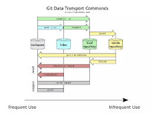

# gioi thieu ve git
---
## git la gi?
`Git là một hệ thống quản lý phiên bản phân tán (DVCS - Distributed Version Control System). Được phát triển bởi Linus Torvalds vào năm 2005 để quản lý mã nguồn của dự án Linux, Git đã trở thành một trong những công cụ quản lý phiên bản phổ biến nhất trên thế giới`. 

Với Git, các nhà phát triển có thể làm việc trên dự án một cách song song, mỗi người có thể có bản sao đầy đủ của toàn bộ lịch sử của dự án trên máy tính cá nhân của mình. Git cung cấp các tính năng như nhánh (branching) và ghép nhánh (merging), cho phép người dùng thực hiện các thay đổi mà không ảnh hưởng đến những người khác trong dự án cho đến khi họ sẵn sàng để hợp nhất các thay đổi đó vào phiên bản chính.

Git còn cung cấp một số tính năng khác như lịch sử sửa đổi (commit history), hỗ trợ điều tra lỗi (bug tracking), và các công cụ hợp tác giúp người dùng làm việc cùng nhau trên các dự án phức tạp.
## Mo hinh cua git

## nhung loi ich va tac hai cua git
### Lợi ích của Git
- Quản lý phiên bản hiệu quả: Git cho phép theo dõi lịch sử sửa đổi của mã nguồn, giúp người phát triển xem xét và quản lý các thay đổi một cách dễ dàng.

- Hỗ trợ làm việc song song: Git cho phép nhiều nhà phát triển làm việc trên cùng một dự án mà không gặp xung đột, nhờ vào tính năng nhánh (branching) và ghép nhánh (merging).

- Tăng tính linh hoạt: Người dùng có thể làm việc ngoại tuyến và đồng bộ mã nguồn sau này, giúp họ làm việc từ bất kỳ đâu và bất kỳ khi nào.

- Bảo mật: Git cho phép quản lý quyền truy cập, giúp bảo vệ mã nguồn khỏi việc chỉnh sửa không cẩn thận hoặc truy cập trái phép.

- Cộng đồng lớn: Git là một trong những hệ thống quản lý phiên bản phổ biến nhất, với một cộng đồng lớn, có nhiều tài liệu học tập và hỗ trợ.
### Tác hại của Git
- Học cú pháp phức tạp: Git có thể có một ngưỡng học cú pháp ban đầu khá cao, đặc biệt đối với người mới bắt đầu sử dụng.

- Xung đột ghép nhánh: Khi làm việc với nhiều nhánh, có thể xảy ra xung đột khi ghép nhánh lại với nhau, đặc biệt là trong các dự án lớn với nhiều người cùng làm việc.

- Dữ liệu lịch sử lớn: Lịch sử của một dự án có thể trở nên lớn và khó quản lý, đặc biệt khi lịch sử này chứa nhiều thay đổi nhỏ và không cần thiết.

- Khó khăn trong giải quyết xung đột: Trong một số trường hợp, việc giải quyết xung đột có thể mất thời gian và làm gián đoạn quy trình phát triển.
## Điểm giống và khác nhau giữa git và github
### Điểm giống:
- Quản lý mã nguồn: Cả Git và GitHub đều liên quan đến việc quản lý mã nguồn của một dự án phần mềm.

- Hỗ trợ phiên bản phân tán: Cả hai đều hỗ trợ mô hình phiên bản phân tán, cho phép nhiều người cùng làm việc trên dự án một cách độc lập.

- Nhánh và ghép nhánh: Cả Git và GitHub đều hỗ trợ việc tạo và quản lý nhánh (branch) để phát triển song song và ghép nhánh (merge) để tích hợp các thay đổi từ các nhánh khác nhau.

- Lịch sử sửa đổi: Cả hai đều cho phép xem xét lịch sử sửa đổi của mã nguồn, bao gồm các commit và thay đổi cụ thể.
### Khác biệt:
- Git: Là một hệ thống quản lý phiên bản phân tán (DVCS) được sử dụng trên máy tính cá nhân. Git không yêu cầu kết nối internet để hoạt động và có thể sử dụng độc lập.

- GitHub: Là một dịch vụ lưu trữ mã nguồn trực tuyến dựa trên Git. GitHub cung cấp một nền tảng để lưu trữ, quản lý và hợp tác trên mã nguồn của dự án. Nó cung cấp các tính năng như quản lý issue, pull request, wiki, và nhiều tính năng khác để hỗ trợ quá trình phát triển phần mềm cộng đồng.

- Sử dụng: Git là một phần mềm cụ thể, còn GitHub là một dịch vụ trực tuyến mà có thể sử dụng Git như là một phần của nó. GitHub cũng không phải là duy nhất - có các dịch vụ khác như GitLab và Bitbucket cũng cung cấp các chức năng tương tự như GitHub nhưng có một số điểm khác biệt trong cách triển khai và tính năng.