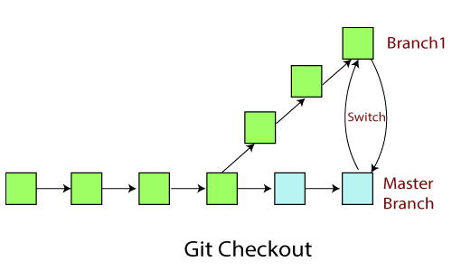

# Các thuật ngữ Git quan trọng
## Branch
Các Branch (`nhánh`) đại diện cho các phiên bản cụ thể của một kho lưu trữ tách ra từ project chính của bạn.

Branch cho phép bạn theo dõi các thay đổi thử nghiệm bạn thực hiện đối với kho lưu trữ và có thể hoàn nguyên về các phiên bản cũ hơn.

### câu lệnh git Branch trong git bash
Trong Git Bash, câu lệnh git branch được sử dụng để quản lý và hiển thị thông tin về các nhánh trong repository Git. Dưới đây là cách sử dụng câu lệnh git branch:
- Hiển thị danh sách các nhánh:
```sh
git branch
```
Câu lệnh này sẽ liệt kê tất cả các nhánh hiện có trong repository và đánh dấu nhánh hiện tại bằng một dấu sao (*).
- Tạo một nhánh mới:
```sh
git branch <branch_name>
```
VD:
```sh
git branch feature1
```
Câu lệnh này sẽ tạo một nhánh mới có tên là feature1 từ nhánh hiện tại.
- Xóa một nhánh:
```sh
git branch -d <branch_name>
```
VD:
```sh
git branch -d feature1
```
Câu lệnh này sẽ xóa nhánh có tên là feature1. Lưu ý rằng để xóa một nhánh, bạn cần phải không đang ở trên nhánh đó.
- Chuyển đến một nhánh khác:
```sh
git checkout <branch_name>
```
VD
```shgit checkout feature1
```
Câu lệnh này sẽ chuyển đến nhánh có tên là feature1
- Tạo một nhánh mới và chuyển đến nhánh đó:
```sh
git checkout -b <new_branch_name>
```
VD
```sh
git checkout -b feature1
```
Câu lệnh này sẽ tạo một nhánh mới có tên là feature1 và chuyển đến nhánh này.
## Commit
Một commit đại diện cho một thời điểm cụ thể trong lịch sử dự án của bạn. Sử dụng lệnh commit kết hợp với lệnh git add để cho git biết những thay đổi bạn muốn lưu vào local repository.
```sh
git commit -m "message"
```
## Checkout
Sử dụng lệnh git checkout để chuyển giữa các branch.

### câu lệnh git Checkout trong git bash
Trong Git Bash (một môi trường dòng lệnh cho Git trên hệ điều hành Windows), câu lệnh git checkout được sử dụng để thực hiện các thao tác như chuyển đổi giữa các nhánh, di chuyển đến các commit cụ thể hoặc khôi phục các file từ một nhánh khác. Dưới đây là một số cách sử dụng câu lệnh git checkout trong Git Bash:
- Chuyển đổi giữa các nhánh:
```sh
git checkout <branch_name>
```
- Di chuyển đến một commit cụ thể:
```sh
git checkout <commit_hash>
```
- Tạo nhánh mới từ một commit cụ thể:
```sh
git checkout -b <new_branch_name> <commit_hash>
```
- Khôi phục các file từ một nhánh khác:
```sh
git checkout <branch_name> -- <file_path>
```
## Fetch
Lệnh git fetch tìm nạp các bản sao và tải xuống tất cả các tệp branch vào máy tính của bạn. Sử dụng nó để lưu các thay đổi mới nhất vào kho lưu trữ của bạn. Nó có thể tìm nạp nhiều branch cùng một lúc.

### câu lệnh git Fetch trong sit bash
Trong Git Bash, câu lệnh git fetch được sử dụng để tải về các thay đổi từ remote repository mà không tự động thực hiện hợp nhất (merge) với nhánh hiện tại. Dưới đây là cú pháp và một số cách sử dụng câu lệnh git fetch:
- Tải về các thay đổi từ remote repository:
```sh
git fetch
```
Câu lệnh này sẽ tải về các thay đổi mới nhất từ remote repository mà bạn đã đặt làm upstream (thông thường là origin) mà không hợp nhất chúng với nhánh hiện tại trên máy tính của bạn.
- Tải về các thay đổi từ một remote branch cụ thể:
```sh
git fetch <remote_name> <branch_name>
```
VD
```sh
git fetch origin main
```
Câu lệnh này sẽ tải về các thay đổi mới nhất từ nhánh `main` của remote repository có tên là `origin`.
- Tải về tất cả các nhánh từ remote repository:
```sh
git fetch --all
```
Câu lệnh này sẽ tải về tất cả các thay đổi từ tất cả các nhánh trên remote repository mà bạn đã đặt làm upstream.
## Fork
Một fork là một bản sao của một kho lưu trữ (`repository`). Các lập trình viên thường tận dụng lợi ích của fork để thử nghiệm các thay đổi mà không ảnh hưởng đến dự án chính.

## Head
Các commit ở đầu của một branch được gọi là `head`. Nó đại diện cho commit mới nhất của `repository` mà bạn hiện đang làm việc.

### câu lệnh git Head trong git bash
Trong Git Bash, câu lệnh git head không tồn tại. Tuy nhiên, HEAD (viết hoa) là một khái niệm quan trọng trong Git và thường được sử dụng để tham chiếu đến commit hiện tại trong repository của bạn.

HEAD là một con trỏ mà bạn có thể di chuyển để trỏ tới một commit cụ thể, một nhánh hoặc một thẻ (tag). Nó luôn trỏ tới commit cuối cùng trong nhánh hiện tại hoặc commit mà bạn đang làm việc.

Dưới đây là một số cách sử dụng `HEAD` trong Git:
- Hiển thị commit hiện tại mà `HEAD` trỏ tới:
```sh
git show HEAD
```
- Di chuyển `HEAD` đến một commit cụ thể:
```sh
git checkout <commit_hash>
```
Sau khi chạy lệnh trên, `HEAD` sẽ trỏ tới commit có mã hash bạn đã chỉ định.
- Di chuyển `HEAD` đến một nhánh hoặc thẻ (tag):
```sh
git checkout <branch_name_or_tag>
```
VD
```sh
git checkout main
```
Sau khi chạy lệnh trên, `HEAD` sẽ trỏ tới commit cuối cùng của nhánh `main`.
- Hiển thị thông tin về **HEAD** hiện tại:
```sh
git log -1 HEAD
```
Lệnh này sẽ hiển thị thông tin về commit mà *HEAD* đang trỏ tới.
## Index
Bất cứ khi nào bạn thêm, xóa hoặc thay đổi một file, nó vẫn nằm trong chỉ mục cho đến khi bạn sẵn sàng commit các thay đổi. Nó như là khu vực tổ chức (*stagging area*) cho Git. Sử dụng lệnh git status để xem nội dung của index của bạn.


## Master
Master là nhánh chính của tất cả các repository của bạn. Nó nên bao gồm những thay đổi và commit gần đây nhất.
## Merge
Lệnh git merge kết hợp với các yêu cầu kéo (`pull requests`) để thêm các thay đổi từ nhánh này sang nhánh khác.
## Origin
Origin là phiên bản mặc định của repository. Origin cũng đóng vai trò là bí danh hệ thống để liên lạc với nhánh chính.

Lệnh git push origin master để đẩy các thay đổi cục bộ đến nhánh chính.
## Pull
Pull requests thể hiện các đề xuất thay đổi cho nhánh chính. Nếu bạn làm việc với một nhóm, bạn có thể tạo các pull request để yêu cầu người bảo trì kho lưu trữ xem xét các thay đổi và hợp nhất chúng.

Lệnh git pull được sử dụng để thêm các thay đổi vào nhánh chính.
## Push
Lệnh git push được sử dụng để cập nhật các nhánh từ xa với những thay đổi mới nhất mà bạn đã commit.
## Rebase
Lệnh git rebase cho phép bạn phân tách, di chuyển hoặc thoát khỏi các commit. Nó cũng có thể được sử dụng để kết hợp hai nhánh khác nhau.
## Remote
Một Remote (kho lưu trữ từ xa) là một bản sao của một chi nhánh. Remote giao tiếp ngược dòng với nhánh gốc (origin branch) của chúng và các Remote khác trong kho lưu trữ.
## Repository
Kho lưu trữ Git chứa tất cả các tệp dự án của bạn bao gồm các branch, tags và commit.
## Stash
Lệnh git stash sẽ loại bỏ các thay đổi khỏi chỉ mục của bạn và xóa stashes chúng đi sau.

Nó có ích nếu bạn muốn tạm dừng những gì bạn đang làm và làm việc khác trong một khoảng thời gian. Bạn không thể đặt stash nhiều hơn một bộ thay đổi ở cùng một thời điểm.
## Upstream
Trong ngữ cảnh của Git, upstream đề cập đến nơi bạn push các thay đổi của mình, thường là nhánh chính (master branch).

các bạn có thể tìm hiểu thêm các khai niệm khác của git tại đây

## nguon
https://viblo.asia/p/git-tong-quan-ve-git-1VgZvJ2YZAw